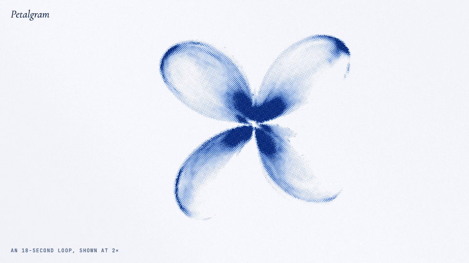
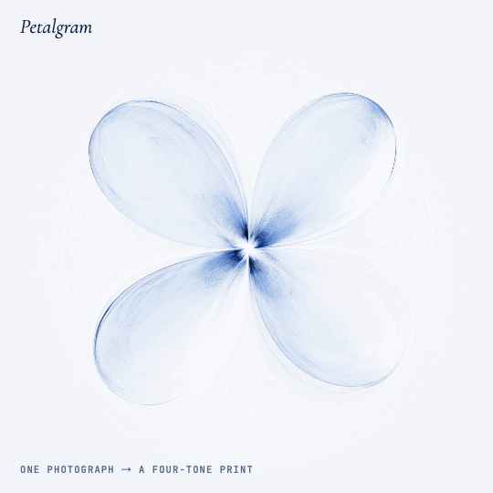
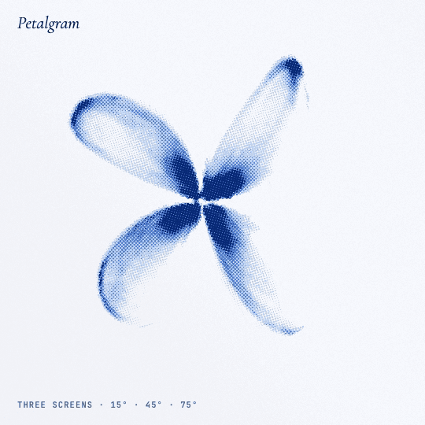
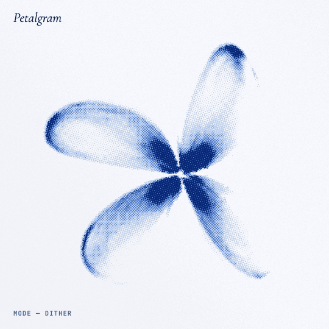
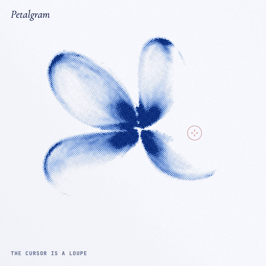
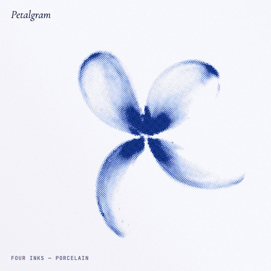

# Petalgram № 01

One photograph, re-set as living ink. A single still image of a four-petalled flower is warped, choreographed and printed as halftone, sixty times a second, in the browser.

No video, no 3D model, no libraries: one HTML file, WebGL2, and `flower.webp`.



## Highlights

<table>
<tr>
<td width="50%"></td>
<td width="50%"></td>
</tr>
<tr>
<td><b>One photograph → a four-tone print.</b> The only input is a still image. Every frame is warped from it and printed again.</td>
<td><b>Three screens at 15°, 45° and 75°.</b> Dots grow with the ink, and where the plates overlap they form real rosettes.</td>
</tr>
<tr>
<td></td>
<td></td>
</tr>
<tr>
<td><b>Dither → Blend → ASCII.</b> Modes morph rather than cut: type appears first in the densest ink and spreads outward.</td>
<td><b>The cursor is a loupe; holding it raises wind.</b> Each petal swings, turns edge-on and curls from base to tip.</td>
</tr>
<tr>
<td></td>
<td valign="top"><b>Four inks.</b> Porcelain, Iris, Ember and Night.<br><br><b>An exact 18-second loop.</b> Every motion term is periodic in 18 s, so the piece closes seamlessly (the loop above plays at 2×).<br><br><b>Frame-exact export.</b> MP4 at 60 fps in 16:9, 4:5 or 1:1, encoded with WebCodecs at exact timestamps.</td>
</tr>
</table>

- `index.html`: the piece
- `making-of.html`: the case study

## Run it

Any static server works:

```bash
python3 -m http.server 5188
```

Then open <http://localhost:5188>. Opening `index.html` directly from disk will not work, because the browser refuses to load the image into WebGL from `file://`.

## Controls

| Input | Action |
|---|---|
| Move the cursor | Loupe: magnifies and nudges the nearest petal |
| Hold the mouse | Wind |
| `1` `2` `3` | Dither · Blend · ASCII (morphs between them) |
| `V` | Play the 9.4 s reel |
| `Space` | Pause |
| `R` | Replay the entrance |

**Export video** records an MP4 at 60 fps in 16:9 (1920×1080), 4:5 (1080×1350) or 1:1 (1080×1080), either the 18 s loop or the reel, with or without the typography. **Export PNG** saves the current frame without type.

## How it works

```
flower.webp ─► INK pass, at cell resolution            ─► DRAW pass, at screen resolution
               polar warp per petal, 18 s choreography     three halftone plates at 15/45/75°,
               depth, shadow, tone curve, trails            ASCII glyphs, loupe
```

- **Motion.** Each of the four petals owns a sector of the photograph. Every frame, each petal swings, turns edge-on at mid-swing, bends from base to tip, and lags behind a flower head that travels a small arc. All of it is driven by a wave with a 6 s period and a breath with a 9 s period, shaped by an 18 s envelope. Every term is periodic in 18 s, so the loop closes exactly.
- **Print.** The ink field is printed as three amplitude-modulated halftone plates, slightly out of register, on paper with grain. ASCII glyphs are ranked by pixel coverage measured at load time.
- **Export.** Frames are rendered from a frame counter and encoded with WebCodecs at exact timestamps. A small hand-written MP4 writer puts the index first. The output is frame-exact whether or not the tab is visible. Browsers without WebCodecs fall back to MediaRecorder, in real time; keep the tab in front for that.
- **Quality.** GPU timer queries watch the frame cost and step the pixel density down (2× → 1.5× → 1.25× → 1×) when a device can't keep up.
- **Accessibility.** With *reduce motion* set, the page holds one still frame. Screen readers get the headline as text, not the decoding animation.

## Deploy

Cloudflare Pages:

```bash
npx wrangler login                                  # once
./deploy.sh                                         # → https://petalgram.pages.dev
SITE_URL=https://your.domain ./deploy.sh            # custom domain
```

`deploy.sh` builds a clean `dist/`, rewrites the social-card image URLs to absolute ones (X requires this), and uploads it. `archive/` holds earlier versions and is not deployed.

## Files

```
index.html       the piece
making-of.html   case study
flower.webp      the source photograph (2000×1394)
poster.png       social card, 1200×630
assets/          stills used by the case study
docs/            the GIFs in this README
_headers         cache and security headers for Cloudflare Pages
deploy.sh        build + deploy
archive/         earlier versions, v0 to v7
```
